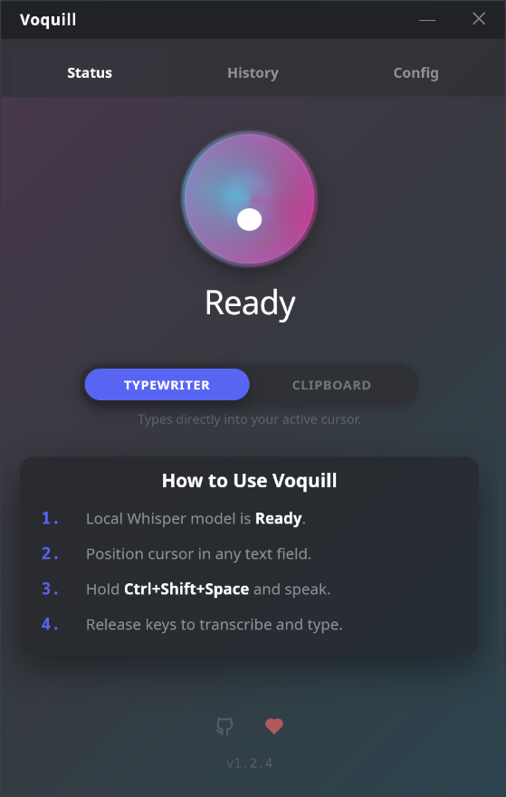
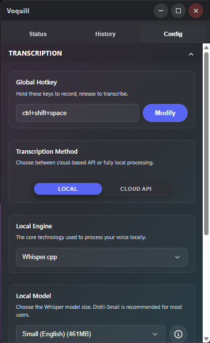
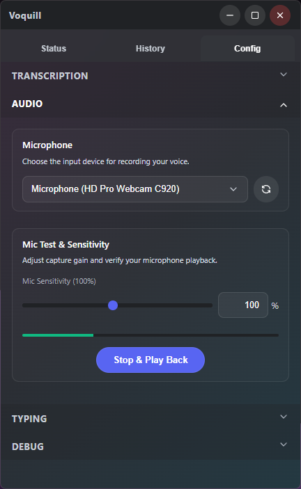
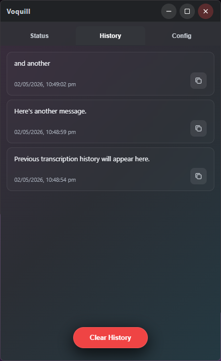

  

<h1 align="center">FOSS Voquill - Private Push-to-Talk Dictation for Windows and Linux</h1>

Truly free, private system-wide push-to-talk dictation tool.

  
  
  

  

FOSS Voquill is offline dictation that works in any app on your system. Your voice never leaves your device, and there are no accounts, subscriptions, or cloud dependencies.

It exists because dictation should be a basic utility, not a locked service. If you want private, system-wide push-to-talk transcription on Linux or Windows, this is built for that workflow.

## Install

Download the latest release here:

- **[Download Latest Release](https://github.com/jackbrumley/voquill/releases/latest)**

Release package options:

- Windows (Most users): Setup EXE (no admin)
- Windows (IT/Admin): System MSI
- Linux (Debian/Ubuntu): `.deb`
- Linux (Fedora/RHEL): `.rpm`
- Linux (Portable): `.AppImage`

Setup EXE installs per-user (no admin). MSI is a system-wide install intended for IT/admin deployment.

## Getting Started

1. **Launch Voquill**
   - On launch, you will see an initial setup screen.
2. **Configure your setup**
   - Set your hotkey, select your model, approve permissions, and choose your microphone.
   - Adjust mic sensitivity so voice is clear without clipping.
   - Use **Test Microphone** with playback to verify quality.
3. **Start dictating**
   - Focus any text field (email, docs, browser, editor).
   - Hold your hotkey `Ctrl + Shift + Space` (default), speak, then release to transcribe.

---

## Screenshots

---

## Features

- **Private by Default** - High-performance offline transcription ensures total data sovereignty.
- **Global Push-to-Talk** - Hold a customizable shortcut to record and release to transcribe instantly.
- **Universal Input** - Transcribed text is injected directly into your active window as keystrokes.
- **Windows and Linux Support** - Native support for Windows and Linux (Wayland + X11).
- **Minimalist Design** - An unobtrusive overlay provides status updates without getting in your way.
- **History Management** - Quickly access, copy, and manage your previous transcriptions.

---

## The Philosophy

FOSS Voquill was created with a simple premise: **voice dictation should be a basic utility, not a subscription service.**

In an era of cloud-first AI, FOSS Voquill stands apart by putting privacy and freedom first:
- **No Backend**: No servers, no cloud, no data collection.
- **No Accounts**: No logins, no tracking, no onboarding.
- **Truly Free**: No subscriptions, no paid tiers. Free to use and build on.
- **Privacy First**: Your voice stays on your device. Transcription runs locally.

---

## How to Build It Yourself

1. **Open Terminal in the project folder**
   - On Windows: open PowerShell in the Voquill folder.
   - On Linux: open your Terminal in the Voquill folder.
2. **Install required project files**
   - Run: `npm install`
   - This downloads everything needed to build Voquill.
3. **Check your system is ready**
   - Run: `npm run deps:check`
   - If anything is missing, it will print the install commands.
4. **Build release packages**
   - Run: `npm run tauri:build`
   - This builds production packages for your current platform.
5. **Find your built files**
   - Linux location: `src-tauri/target/release/bundle/`
   - Windows location: `C:\voquill-build\release\bundle\`
   - This folder contains installer/package files (such as `.msi`, `.deb`, `.rpm`, `.AppImage`).
6. **Optional: Run in development mode**
   - Run: `npm run tauri:dev`
   - This is for live testing while developing.
   - It is not the final packaged release build.

On Windows, all Tauri/Cargo build artifacts are written to `C:\voquill-build` to avoid long-path build failures.

---

## Known Issues

- Linux input is currently limited to standard English characters. Non-English characters and broader Unicode support are planned.
- Language selection acts as a transcription hint and may not work.
- AppImage is a cross-distro fallback, not the primary support target; desktop/portal integration can vary compared to distro-native `.deb`/`.rpm` installs.
- Fedora AppImage builds can fail due to linuxdeploy strip incompatibility with RELR system libraries.

---

## Technology

Voquill is built for performance and security:

- **Tauri** - Lightweight desktop framework.
- **Rust** - High-performance systems backend.
- **Whisper.cpp** - Optimized on-device speech recognition.
- **Preact** - Clean and responsive interface.
- **Vite + npm** - Frontend tooling and script orchestration.

---

## License

This project is licensed under the GNU Affero General Public License v3.0 - see the [LICENSE](LICENSE) file for details.

---

### Project Provenance
*FOSS Voquill is the original project, first published in July 2025. Built to give back to the open-source community. Truly free and Open Source*

[Report Bug](https://github.com/jackbrumley/voquill/issues) • [Request Feature](https://github.com/jackbrumley/voquill/issues)

