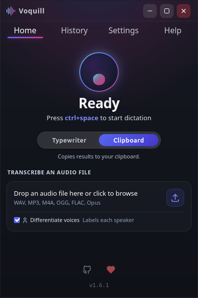
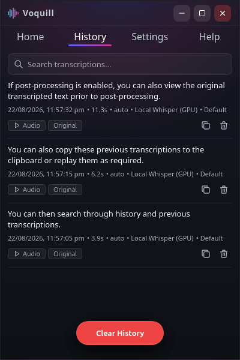
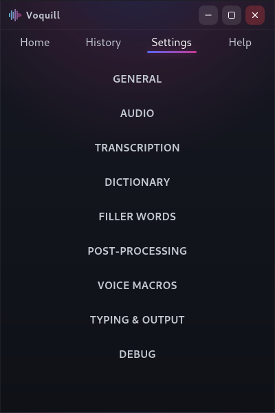
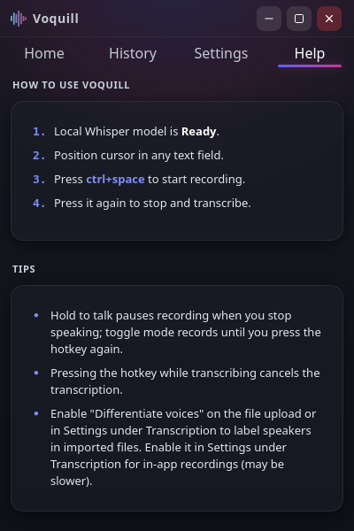

  

<h1 align="center">FOSS Voquill - Private Push-to-Talk Dictation for Windows and Linux</h1>

Truly free, private system-wide push-to-talk dictation tool.

  
  
  
  

  

FOSS Voquill is offline dictation that works in any app on your system. Your voice never leaves your device, and there are no accounts, subscriptions, or cloud dependencies. On Linux, it uses XDG Portals for native Wayland support.

It exists because dictation should be a basic utility, not a locked service. If you want private, system-wide push-to-talk transcription on Linux or Windows, this is built for that workflow.

## Screenshots

  
  

  
  

## Install

Download the latest release here:

- **[Download Latest Release](https://github.com/jackbrumley/voquill/releases/latest)**

Release package options:

- Windows (Most users): Setup EXE (no admin)
- Windows (IT/Admin): System MSI
- Linux (Debian/Ubuntu): `.deb`
- Linux (Fedora/RHEL): `.rpm`
- Linux (Portable): `.AppImage`

Setup EXE installs per-user (no admin). MSI is a system-wide install intended for IT/admin deployment.

## Getting Started

1. **Launch Voquill**
   - On launch, you will see an initial setup screen.
2. **Configure your setup**
   - Set your hotkey, select your model, approve permissions, and choose your microphone.
   - Adjust mic sensitivity so voice is clear without clipping.
   - Use **Test Microphone** with playback to verify quality.
3. **Start dictating**
   - Focus any text field (email, docs, browser, editor).
   - Hold your hotkey `Ctrl + Shift + Space` (default), speak, then release to transcribe.

## Features

- **Private & Offline by Default** — On-device speech recognition powered by Whisper.cpp (Vulkan GPU / CPU) and NVIDIA Parakeet. Your voice never leaves your machine—no accounts, no cloud dependencies, no subscriptions.
- **Push-to-Talk & Toggle Modes** — Choose between Hold-to-Talk or Toggle mode. Customizable global hotkey with instant capture UI and press-to-cancel support during transcription.
- **Transcript Post-Processing (Local & Cloud AI)** — Clean up transcripts, fix grammar, punctuation, and speech artefacts using local LLMs (Qwen 2.5 1.5B, Llama 3.2 1B) or OpenAI-compatible cloud APIs (OpenRouter, Groq, Ollama, vLLM). Create custom presets and compare original vs. cleaned text.
- **Audio File Transcription** — Drag-and-drop or browse audio files (WAV, MP3, M4A, FLAC, OGG). Fully integrated with speaker differentiation and post-processing.
- **Differentiate Voices (Speaker Diarization)** — Detect and label distinct speakers (`Speaker 1`, `Speaker 2`) in both imported audio files and live dictations with configurable cluster sensitivity.
- **NVIDIA Parakeet Engine** — Fast, CPU-optimized transcription supporting 25 languages with automatic background model warm-up.
- **Audio Noise Reduction** — Optional spectral gating to eliminate background noise (fans, room hum, electrical noise) before transcription. Configurable strength slider and recording up to 180 minutes (3 hours).
- **Custom Dictionary & Vocabulary Hints** — Add names, acronyms, and technical jargon that are supplied directly to transcription models as vocabulary hints.
- **Instant Filler Word Removal** — Strips "uh", "um", "you know", "kind of" instantly via regex without needing an AI model. Supports custom filler phrases.
- **Reliable Pasting & Terminal Support** — Typewriter mode (direct hardware simulation) or Clipboard mode with configurable paste shortcuts (`Shift+Insert`, `Ctrl+V`, `Ctrl+Shift+V`) and automatic clipboard restoration. Defaults to `Shift+Insert` for full Linux terminal compatibility.
- **Searchable History & Native Audio Playback** — SQLite-backed with FTS5 search. Listen back to recordings directly within the app, toggle between original and cleaned text, delete individual entries, or clear all. Configurable history retention with automatic disk pruning.
- **Audio Device & Playback Selection** — Select independent input microphones and output playback devices with built-in mic testing and live sensitivity metering.
- **Full Wayland & Windows Integration** — Native XDG Desktop Portals on Wayland (GNOME, KDE, Hyprland), native X11, and Windows CoreAudio/SendInput. Supports launch at startup and `--start-hidden` to launch minimized to tray.
- **Minimalist Overlay** — Transparent status overlay during recording and transcription. Platform-native positioning (Layer Shell on Wayland).

> See the full feature breakdown with planned items at [docs/FEATURES.md](docs/FEATURES.md).

---

## The Philosophy

FOSS Voquill was created with a simple premise: **voice dictation should be a basic utility, not a subscription service.**

In an era of cloud-first AI, FOSS Voquill stands apart by putting privacy and freedom first:
- **No Backend**: No servers, no cloud, no data collection.
- **No Accounts**: No logins, no tracking, no onboarding.
- **Truly Free**: No subscriptions, no paid tiers. Free to use and build on.
- **Privacy First**: Your voice stays on your device. Transcription runs locally.

## Watch the Promo

Prefer direct link: https://youtu.be/yKKyPUwEpDg

---

## How to Build It Yourself

1. **Open Terminal in the project folder**
   - On Windows: open PowerShell in the Voquill folder.
   - On Linux: open your Terminal in the Voquill folder.
2. **Install required project files**
   - Run: `npm install`
   - This downloads everything needed to build Voquill.
3. **Check your system is ready**
   - Run: `npm run deps:check`
   - If anything is missing, it will print the install commands.
4. **Build release packages**
   - Run: `npm run tauri:build`
   - This builds production packages for your current platform.
5. **Find your built files**
   - Linux location: `src-tauri/target/release/bundle/`
   - Windows location: `C:\vb\release\bundle\`
   - This folder contains installer/package files (such as `.msi`, `.deb`, `.rpm`, `.AppImage`).
6. **Optional: Run in development mode**
   - Run: `npm run tauri:dev`
   - This is for live testing while developing.
   - It is not the final packaged release build.

On Windows, all Tauri/Cargo build artifacts are written to `C:\vb` to avoid long-path build failures (the Vulkan shader build nests deeply enough to exceed the 260-character limit under longer roots).

---

## Known Issues

- Language selection acts as a transcription hint and may not be reliably applied by all engines.
- Unicode and non-English keyboard input is best-effort; the Typewriter mode normalizes common Unicode characters (curly quotes, em-dashes, ellipses) to ASCII equivalents.
- AppImage is a cross-distro fallback, not the primary support target; desktop/portal integration can vary compared to distro-native `.deb`/`.rpm` installs.
- Fedora AppImage builds can fail due to linuxdeploy strip incompatibility with RELR system libraries.

---

## Technology

Voquill is built for performance and security:

- **Tauri** - Lightweight desktop framework.
- **Rust** - High-performance systems backend.
- **Whisper.cpp** - Optimized on-device speech recognition.
- **Preact** - Clean and responsive interface.
- **Vite + npm** - Frontend tooling and script orchestration.

---

## License

This project is licensed under the GNU Affero General Public License v3.0 — see the [LICENSE](LICENSE) file for details.

### Why AGPLv3?

Voquill is my small way of giving back to the open source community.

I chose AGPLv3 to make sure it stays genuinely open for everyone. You are completely free to use, learn from, and build on this code — the only ask is that if you make improvements, those changes are shared back with the community rather than locked away.

---

### Project Provenance
*FOSS Voquill is the original project, first published in July 2025. Built to give back to the open-source community. Truly free and Open Source*

[Report Bug](https://github.com/jackbrumley/voquill/issues) • [Request Feature](https://github.com/jackbrumley/voquill/issues)

