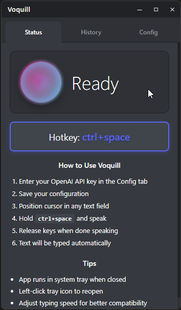

# Voquill

**Cross-platform push-to-talk dictation app with Whisper-powered speech recognition**

*System-wide accurate voice dictation - speech to text in any app, anywhere*

---

## ✨ Current Features

- **Global Push-to-Talk** - Hold a customizable key combination to record anywhere on your system  
- **Direct Keyboard Simulation** - Speech becomes actual keystrokes, works in ANY application  
- **OpenAI Whisper Integration** - Cloud-based speech recognition with high accuracy  
- **Cross-Platform Support** - Native support for Windows, macOS, and Linux  
- **Live Visual Feedback** - Unobtrusive overlay shows recording and transcription status  
- **Simple Configuration** - Minimal UI for hotkey and audio settings  
- **Transcription History** - View and copy previous transcriptions to clipboard for easy pasting

## 🚧 For the Future

-  **Local Privacy Mode** - Optional local processing with Whisper.cpp for complete privacy  
-  **Multiple Whisper Providers** - Support for various Whisper API providers beyond OpenAI  

## 🚀 Getting Started

### Download

Ready-to-use binaries are available for all supported platforms:

**[📥 Download Latest Release](https://github.com/jackbrumley/voquill/releases/latest)**

- **Windows**: `.msi` installer or standalone `.exe`
- **macOS**: `.dmg` disk image with drag-to-install
- **Linux**: `.deb` package, `.AppImage`, `.flatpak`, or standalone binary

Platform support:
- **Windows**: Full native support with global hotkeys and text injection
- **macOS**: Full native support using Quartz Event Services  
- **Linux**: Supported on Wayland/GNOME & KDE with proper portal support
- **Immutable Linux**: Flatpak package available for Bazzite, Fedora Silverblue, etc.

### Setup Guide

**Before you start:** Ensure you have a working microphone set as your default audio device.

#### Step 1: Get Your OpenAI API Key

1. **Create an OpenAI Account**: [Sign up](https://platform.openai.com/signup/) or [log in](https://platform.openai.com/account/api-keys) to OpenAI
2. **Generate API Key**: In your dashboard, go to "API Keys" → "Create new secret key"
3. **Copy & Save**: Copy this key somewhere safe - you'll need it in Step 3
   > ⚠️ **Important**: Treat your API key like a password. Never share it publicly.

#### Step 2: Add Credit to Your Account

1. **Go to Billing**: In your OpenAI dashboard, click "Billing"
2. **Add Payment Method**: Add a credit card or payment method
3. **Add Credit**: Even $5 will provide thousands of transcriptions
   > 💡 **Cost**: Whisper API costs about $0.006 per minute of audio (very affordable!)

#### Step 3: Configure Voquill

1. **Install & Launch**: Download and install Voquill for your platform
2. **Enter API Key**: When Voquill opens, paste your OpenAI API key in the settings
3. **Test Your Setup**: Try the default hotkey (`Ctrl + Space`) and speak a few words

#### Step 4: Start Dictating

1. **Position Your Cursor**: Click in any text field (email, document, browser, etc.)
2. **Hold & Speak**: Press and hold `Ctrl + Space` while speaking clearly
3. **Release & Wait**: Let go of the keys and watch your speech become text!
4. **See Status**: The overlay shows "Recording" → "Transcribing" → completion

### Quick Usage Tips

- **Works Everywhere**: Any app with text input - email, Word, browsers, code editors, ai chats
- **Clear Speech**: Speak clearly and at normal pace for best results
- **History**: Access previous transcriptions from the app to copy/paste again

## 📸 Screenshots

### See Voquill in Action

*Watch Voquill transcribe speech directly into any application*

### Application Interface

| Status Overlay | History | Configuration |
|:---:|:---:|:---:|
|  |  |  |
| *Unobtrusive status indicator during recording* | *View and copy previous transcriptions* | *Simple setup with API key and hotkey configuration* |

## 🛠️ Technology

Voquill is built with modern, performant technologies:

- **[Tauri](https://tauri.app/)** - Secure, fast, and lightweight desktop framework
- **[Rust](https://www.rust-lang.org/)** - Systems programming language for the backend
- **[React](https://reactjs.org/)** - Modern UI framework for the frontend
- **[Whisper](https://openai.com/research/whisper)** - Advanced speech recognition model

## 🎯 Use Cases

- **Content Creation** - Dictate blog posts, articles, and documentation
- **Coding** - Voice-driven code comments and documentation
- **Accessibility** - Alternative input method for users with mobility challenges
- **Productivity** - Faster text input for emails, messages, and notes
- **Multilingual** - Supports multiple languages through Whisper

## 🔧 Configuration

Voquill offers simple configuration options:

- **API Key** - Required for speech transcription
- **API URL** - Configurable endpoint (currently tested with OpenAI, other Whisper-compatible APIs may work)
- **Custom Hotkeys** - Set your preferred push-to-talk combination (default: `Ctrl + Space`)
- **Transcription History** - View and copy previous voice recordings and transcriptions to clipboard

### Configuration File Locations

Voquill stores its configuration in the following locations:

- **Linux**: `~/.config/voquill/config.json`
- **Windows**: `%APPDATA%\voquill\config.json`
- **macOS**: `~/Library/Application Support/voquill/config.json`

To reset your configuration, simply delete the config file and restart the application.

## 📚 Documentation

For detailed technical information and development guides:

- **[Build Instructions](docs/BUILD.md)** - How to build Voquill from source
- **[Release Process](docs/RELEASE.md)** - How to create automated releases
- **[Architecture](docs/ARCHITECTURE.md)** - Technical specifications and design decisions
- **[Development Setup](rust/README.md)** - Rust/Tauri specific development guide

## 🤝 Contributing

We welcome contributions! Whether it's:

- 🐛 Bug reports and fixes
- ✨ Feature requests and implementations
- 📚 Documentation improvements
- 🌍 Translations and localization

## 📄 License

This project is licensed under the MIT License - see the [LICENSE](LICENSE) file for details.

## 🙏 Acknowledgments

- **OpenAI** for the incredible Whisper model
- **Tauri Team** for the amazing cross-platform framework
- **Rust Community** for the robust ecosystem

---

**Made with ❤️ for seamless voice-to-text experiences**

[Report Bug](https://github.com/jackbrumley/voquill/issues) • [Request Feature](https://github.com/jackbrumley/voquill/issues) • [Documentation](rust/README.md)

